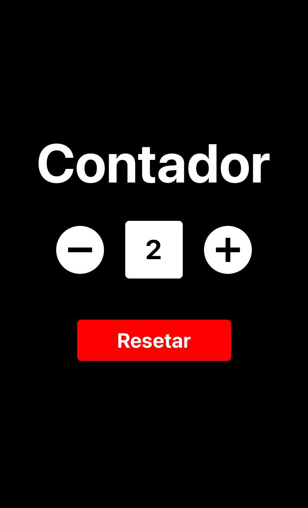

# Contador

<h1 align="center">
  
</h1>
 
## Objetivo
App que realiza contagem. Para exercício do React Hook useState.

## Tecnologias
- React Native
- Expo
- JavaScript

## Status
- [x] Concluído - 10/01/2020

## Links
- [React Native](https://reactnative.dev/)
- [Expo](https://expo.io/)
